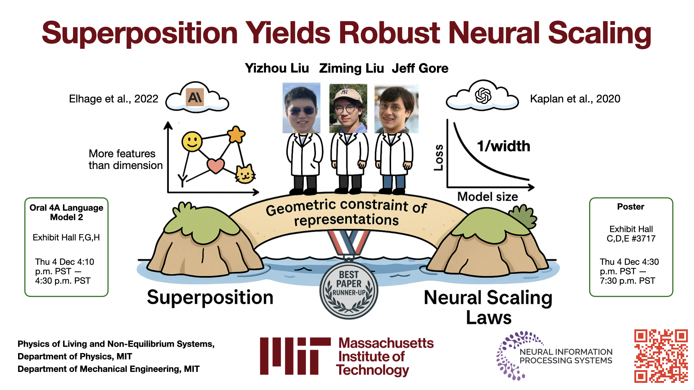
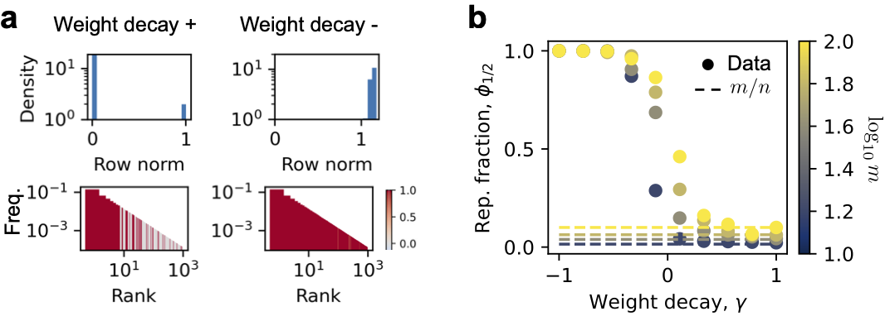
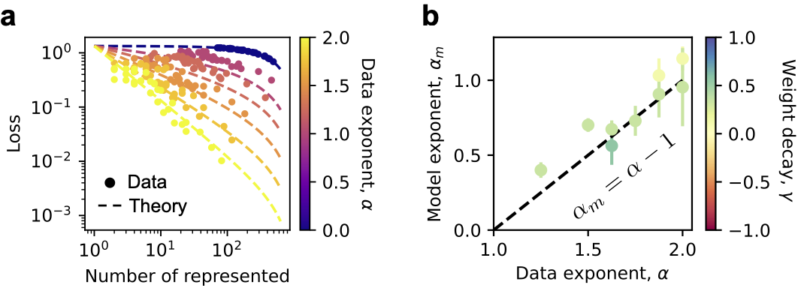
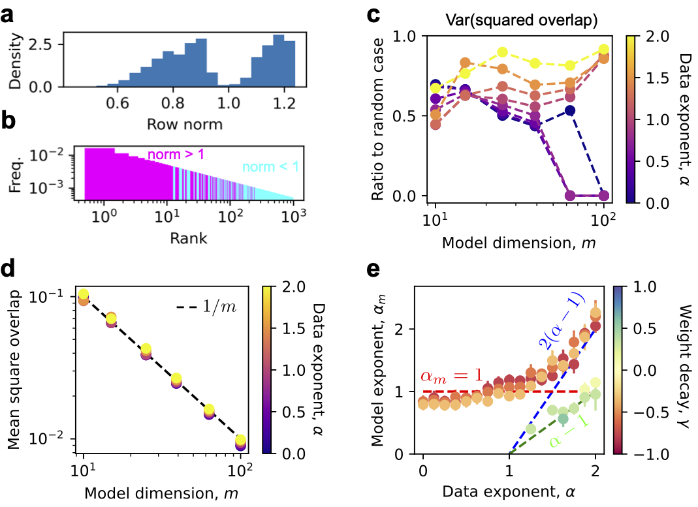

# Representation superposition is an underlying mechanism of neural scaling laws

This is the official github repo for the paper [Superposition Yields Robust Neural Scaling](https://arxiv.org/abs/2505.10465), Yizhou Liu, Ziming Liu, and Jeff Gore, NeurIPS 2025 (Oral, Best Paper Runner-up).

<p align="center" width="100%">

</p>

## Overview of results
Superposition means that models represent more features than dimensions they have, which is true for LLMs since there are too many things to represent in language. We find that superposition leads to a power-law loss with width without assuming power laws elsewhere, leading to the observed neural scaling law. And the reason for the power law is geometric constraint of representations.

The code of the following figure is ['./exp/exp-17.py'](./exp/exp-17.py)

<p align="center" width="100%">

</p>

## The toy model

We use Anthropic's toy model of superposition, adding weight decay or growth to control the degree of superposition.

<p align="center" width="100%">

</p>

## Weight decay

Weight decay (or growth when the value is negative) can control superposition reflected by the fraction of represented features.

The code of the following figure is ['./exp/exp-10.py'](./exp/exp-10.py) and ['./exp/exp-10-3.py'](./exp/exp-10-3.py)

<p align="center" width="100%">

</p>

## Rich phenomena

We need to answer when the loss is a power law with model dimension, and what control the power law exponent (we call it model exponent here).

We analyze the data from ['./exp/exp-17.py'](./exp/exp-17.py), ['./exp/exp-10.py'](./exp/exp-10.py) and ['./exp/exp-10-3.py'](./exp/exp-10-3.py) in the following figure.

<p align="center" width="100%">

</p>

## Weak superposition regime

In the weak superposition regime (weight decay is large), the loss is well described by the expected number of activated but unlearned features, which is a power law once the feature distribution is.

The data are from ['./exp/exp-10.py'](./exp/exp-10.py) and ['./exp/exp-10-3.py'](./exp/exp-10-3.py).

<p align="center" width="100%">

</p>

## Strong superposition

Scaling behavior in the strong superposition regime is robust due to generic geometric fact that when many more vectors are squeezed into a lower dimensional space, their overlaps scale inversely proportional to square root of dimension.

The data are from ['./exp/exp-10.py'](./exp/exp-10.py) and ['./exp/exp-10-3.py'](./exp/exp-10-3.py).

<p align="center" width="100%">

</p>

## Activation density

The scaling exponents are robust to the number of expected activated features in one data point.

The data are from ['./exp/exp-15.py'](./exp/exp-15.py).

<p align="center" width="100%">

</p>

## LLMs

LLMs agree with the toy model results in the strong superposition regime from underlying overlaps between representations to loss scaling with model dimension.

Analysis of overlaps is in ['./LLMs/overlap-0.py'](./LLMs/overlap-0.py). We also analyzed norm distribution in ['./LLMs/norm-0.py'](./LLMs/norm-0.py) and token frequencies in ['./LLMs/token-freq-0.py'](./LLMs/token-freq-0.py) (see Appendix in the paper). Loss evaluation can be found in ['./LLMs/cali-1.py'](./LLMs/cali-1.py).

<p align="center" width="100%">

</p>

## Citation

```
@article{liu2025superposition,
  title={Superposition yields robust neural scaling},
  author={Liu, Yizhou and Liu, Ziming and Gore, Jeff},
  journal={arXiv preprint arXiv:2505.10465},
  year={2025}
}
```